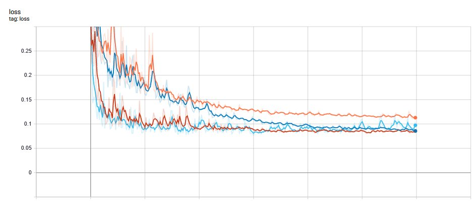
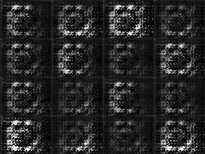
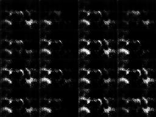
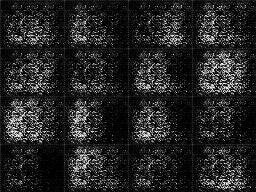
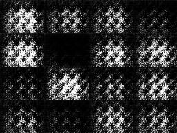

# NCK 2020

*Author: David Coufal, The Czech Academy of Sciences, Institute of Computer Science*

A Python library for robot navigation

## Keywords:
- data preparation
- effective data processing
- convolutional neural network
- generative adversial network (GAN)
- conditional GANs
- DCGAN, LSGAN, cDCGAN, cLSGAN

## Requirements:

tensorflow 2, keras, numpy

## Scripts:
- tfrec2gan.py 
- nck_net.py
- nck_dcgan.py
- nck_lsgan.py
- nck_dcganc.py
- nck_lsganc.py

## Usage:

see Jupyter notebooks in ntbs directory


 
## Data preparation - tfrec2gan:
```
Commands:

  conda activate tf22 #TensorFlow 2.2
  python tfrec2gan.py
```

## Learning - nck_net:
```
Commands:

  conda activate tf22 #TensorFlow 2.2
  python nck_net.py
```

Learning progress for DEPTH=2 (orange), DEPTH=4 (dark blue), DEPTH=6 (red) a DEPTH=8 (light blue)



## GANs  - nck_dcgan, nck_dcganc:
```
Commands:

  conda activate tf22 #TensorFlow 2.2
  python nck_dcgan.py
  python nck_dcganc.py
```

<table>
    <tr><td style="text-align:center; font-size: large" >DCGAN</td>
        <td>&nbsp;</td>
        <td style="text-align:center; font-size: large">cDCGAN</td></tr>
    <tr><td></td>
        <td>&nbsp;</td>
        <td></td>
    </tr>    
</table>    

## GANs - nck_lsgan, nck_lsganc:
```
Commands:

  conda activate tf22 #TensorFlow 2.2
  python nck_lsgan.py
  python nck_lsganc.py
```

<table>
    <tr><td style="text-align:center; font-size: large" >LSGAN</td>
        <td>&nbsp;</td>
        <td style="text-align:center; font-size: large">cLSGAN</td></tr>
    <tr><td></td>
        <td>&nbsp;</td>
        <td></td>
    </tr>    
</table>    


```python

```
