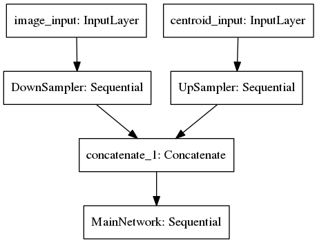

# save-the-robot

Just trying to improve life of one robot.

to run on haklnv:

```
# in virtual environment
$ pip install numpy
$ pip install keras 
$ pip install /opt/data/tensorflow-1.12.0-cp36-cp36m-linux_x86_64.whl
$ pip install sklearn

$ python test.py simple_test 
or
$ python test.py crossvalidation
```


### Hints:

[CUDA_VISIBLE_DEVICES](https://devblogs.nvidia.com/cuda-pro-tip-control-gpu-visibility-cuda_visible_devices/)

> To use it, set CUDA_VISIBLE_DEVICES to a comma-separated list of
> device IDs to make only those devices visible to the application.
> Note that you can use this technique both to mask out devices or to
> change the visibility order of devices so that the CUDA runtime
> enumerates them in a specific order.


### Architecture 



